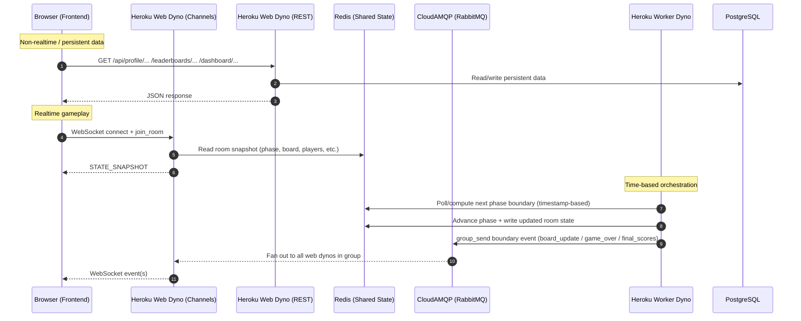

# 🎲 Boojum Games (Frontend)

Live multiplayer word games (Boggle-style) with real-time rooms, chat, tournaments, and mid-game joining.

- **Frontend:** https://boojumgames.com (Vercel)
- **Backend API + WebSockets:** https://api.boojumgames.com (Heroku)
- **Repo:** https://github.com/alexrobincrabbe/Boojum-frontend

> This repository contains the **React + TypeScript frontend**.  
> The backend is currently maintained in a **private repository**.

---

## ✨ What this frontend does

- Renders live game rooms (board, players, scoring, end-of-round summaries)
- Connects via **WebSockets** for real-time events (board updates, players, game boundaries, scores)
- Uses the **REST API** for non-realtime data (profile, dashboard, leaderboards, etc.)
- Runs timers client-side using server timestamps (no per-second server broadcasts)

---

## 🏗 Architecture overview

```mermaid
flowchart LR
  %% Clients
  U[Player Browser] -->|HTTPS| FE[React + TypeScript\n(Vite)]
  FE -->|REST API| API[Heroku Web Dynos\nDjango + DRF]
  FE -->|WebSocket| WS[Heroku Web Dynos\nDjango Channels]

  subgraph Infra["Shared infrastructure"]
    AMQP[(CloudAMQP / RabbitMQ\nChannels group messaging)]
    REDIS[(Redis\nRoom & game state)]
    DB[(PostgreSQL)]
    CLOUD[(Cloudinary\nMedia storage)]
  end

  WS <--> AMQP
  API <--> DB
  WS <--> REDIS
  API --> CLOUD

  WORKER[Heroku Worker Dyno\nPhase transitions & scheduling] <--> REDIS
  WORKER <--> AMQP
  WORKER <--> DB
```

## Data flow: REST vs WebSockets vs shared state

This diagram shows what goes where (and why).



## WebSocket event model (high level)

```mermaid
flowchart TD
  A[Client connects] --> B[STATE_SNAPSHOT]
  B --> C{Realtime events}
  C --> D[DELTA_UPDATE\nplayers/presence changes]
  C --> E[board_update\nstart of round]
  C --> F[timer boundary\nphase changes only]
  C --> G[game_over\nend of round]
  C --> H[final_scores\nresults broadcast]

  subgraph ClientSideTimer["Client-side timer"]
    T1[serverNow + phaseStartedAt + duration] --> T2[Compute remaining time locally]
    T2 --> T3[UI ticks locally\n(no per-second server messages)]
  end

  B --> ClientSideTimer
```


Why this architecture?

This design is driven by three real-world constraints:

1) Multi-dyno correctness (no “split brain” rooms)

With more than one backend instance, in-memory state is unsafe because each dyno has its own memory.

Using Redis as the shared state store ensures:

consistent room/game state across instances

reliable mid-game joining (server can always reconstruct a snapshot)

worker + web dynos coordinate through shared state (no reliance on process memory)

2) Low message volume (broker limits + cost)

A “tick every second” server timer can explode message volume (especially with multiple rooms) and can exceed free/low-tier broker limits.

3) Client-side progress storage is intentionally used for transient per-player data (e.g. words found during a round).
This avoids excessive server updates while ensuring players can recover seamlessly from disconnects without losing progress.

Instead:

the server stores phase + phase start timestamp + duration

the frontend computes time remaining locally

the backend sends only boundary events (start/end/scoring)

Result:

smooth countdown UI

far fewer messages

scales to more rooms cheaply

3) Clear responsibility split (web vs worker)

Web dynos handle WebSockets and API requests (connection handling + routing)

Worker dyno handles time-based orchestration (phase transitions, triggers)

This keeps the WebSocket layer responsive and prevents long-running scheduling logic from being tied to one web process.

🔌 Real-time communication model

The frontend receives WebSocket updates for:

player presence / players list updates

board updates at round start

round-end announcements

final score broadcasts

Timers are computed client-side based on server timestamps so timing stays accurate even if:

a player joins mid-round

the connection drops and reconnects briefly

🗄 Tech stack (platform)
Frontend (this repo)

## Reconnection & client-side resilience

Boojum is designed to handle temporary disconnects without penalizing players.

Client-side progress persistence

During an active game, the frontend stores current game progress in localStorage, including:

words found so far

current score

per-word discovery state

current game round identifier

If a player:

refreshes the page

briefly loses connection

disconnects and reconnects to the same room

…the frontend restores this local state and resynchronizes with the server using the latest room snapshot.

Why this is done client-side

Prevents accidental score loss due to network issues

Avoids unnecessary server writes for every word found

Keeps the real-time message volume low

Allows smooth reconnection even mid-round

The server remains the authoritative source for:

round timing

board configuration

final score submission and validation

This hybrid approach balances resilience, performance, and cost efficiency.

React + TypeScript

- Vite

- Axios

- WebSockets

Backend (private repo)

- Django + Django REST Framework

- Django Channels (WebSockets)

- CloudAMQP (RabbitMQ) as Channels channel layer

- Redis for room/game state

- Heroku worker dyno for game phases/transitions

- PostgreSQL for persistent storage

- Cloudinary for media storage 

👤 Author

Built by Alex Crabbe
