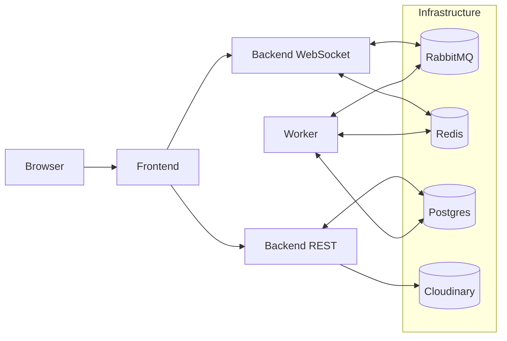
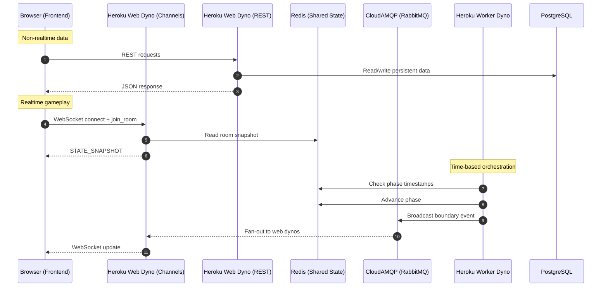
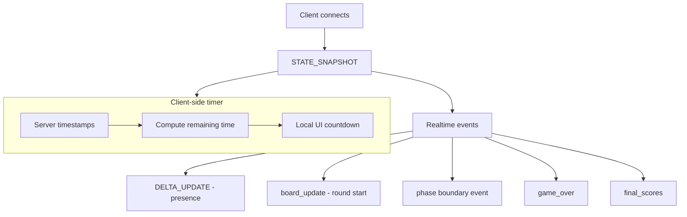

# 🎲 Boojum Games (Frontend)

Live multiplayer word games (Boggle-style) with real-time rooms, chat, tournaments, and mid-game joining.

- **Frontend:** https://boojumgames.com (Vercel)
- **Backend API + WebSockets:** https://api.boojumgames.com (Heroku)
- **Repo:** https://github.com/alexrobincrabbe/Boojum-frontend

> This repository contains the **React + TypeScript frontend**.  
> The backend is currently maintained in a **private repository**.

---

## ✨ What this frontend does

- Renders live game rooms (board, players, scoring, end-of-round summaries)
- Connects via **WebSockets** for real-time events (board updates, players, game boundaries, scores)
- Uses the **REST API** for non-realtime data (profile, dashboard, leaderboards, etc.)
- Runs timers client-side using server timestamps (no per-second server broadcasts)

---

## 🏗 Architecture overview

## Data flow: REST vs WebSockets vs shared state

This diagram shows what goes where (and why).

## WebSocket event model (high level)

## 🧠 Why this architecture?

This design is driven by three real-world constraints.

---

### 1. Multi-dyno correctness (no “split-brain” rooms)

With more than one backend instance, **in-memory state is unsafe** because each dyno has its own memory.

Using **Redis** as a shared state store ensures:

- Consistent room and game state across backend instances  
- Reliable mid-game joining (the server can always reconstruct a full snapshot)  
- Coordination between worker and web dynos without relying on process memory  

---

### 2. Low message volume (broker limits & cost)

A naive server-side timer that ticks every second can quickly explode message volume—especially with multiple rooms—and exceed free or low-tier message broker limits.

To avoid this, Boojum uses a **timestamp-based phase model**:

- The server stores:
  - current phase (`intermission`, `game`, `scoring`)
  - phase start timestamp
  - phase duration
- The frontend computes remaining time locally
- The backend sends **only boundary events** (start, end, scoring)

**Result:**
- Smooth client-side countdown UI  
- Far fewer real-time messages  
- Scales to more concurrent rooms cheaply  

#### Client-side progress storage
Transient per-player data (e.g. words found during a round) is intentionally stored client-side.

This:
- Avoids excessive server updates
- Allows players to recover seamlessly from disconnects
- Keeps real-time traffic minimal

---

### 3. Clear responsibility split (web vs worker)

Responsibilities are clearly separated:

- **Web dynos**
  - Handle WebSocket connections
  - Serve REST API requests
  - Route real-time messages via the channel layer

- **Worker dyno**
  - Manages game timers and phase transitions
  - Triggers board generation and scoring phases
  - Operates independently of WebSocket connections

This separation keeps the WebSocket layer responsive and prevents long-running scheduling logic from being tied to a specific web process.

---

## 🔌 Real-time communication model

The frontend receives WebSocket updates for:

- Player presence and players list updates
- Board updates at the start of a round
- Round-end announcements
- Final score broadcasts

Timers are computed client-side using server timestamps so timing remains accurate even if:

- A player joins mid-round
- The connection briefly drops and reconnects

---

## 🔁 Reconnection & client-side resilience

Boojum is designed to handle temporary disconnects without penalizing players.

### Client-side progress persistence

During an active game, the frontend stores current game progress in `localStorage`, including:

- Words found so far
- Current score
- Per-word discovery state
- Current game round identifier

If a player:

- Refreshes the page
- Briefly loses connection
- Disconnects and reconnects to the same room

…the frontend restores this local state and resynchronizes with the server using the latest room snapshot.

### Why this is done client-side

- Prevents accidental score loss due to network issues
- Avoids unnecessary server writes for every word found
- Keeps real-time message volume low
- Allows smooth reconnection even mid-round

The server remains the **authoritative source** for:

- Round timing
- Board configuration
- Final score submission and validation

This hybrid approach balances **resilience**, **performance**, and **cost efficiency**.

---

## 🗄 Tech stack (platform)

### Frontend (this repository)
- React + TypeScript
- Vite
- Axios
- WebSockets

### Backend (private repository)
- Django + Django REST Framework
- Django Channels (WebSockets)
- CloudAMQP (RabbitMQ) as Channels channel layer
- Redis for room and game state
- Heroku worker dyno for game phases and transitions
- PostgreSQL for persistent storage
- Cloudinary for media storage

👤 Author

Built by Alex Crabbe
